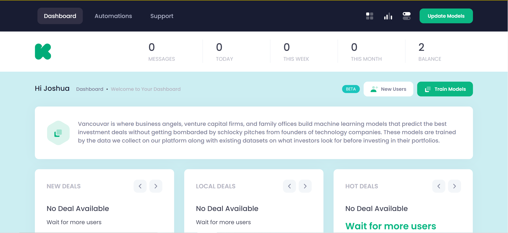

<h1 align="center">
    investor-link
</h1>

## Description
This website is designed to match investors with founders based on parameters. It automates the process of finding suitable investment opportunities.

## Functions
### Account System - 
  Uses the django default user system with additional modifications to carry parameter data.
  #### Pages - 
   * [account/forgot](templates/account/account_forgot.html) - Takes in email of user and sends recovery email to their inbox
   * [account/reset/uidb64/token/](templates/account/account_reset.html) - This url is sent to the user after submission to [account/forgot](templates/account/account_forgot.html) and allows the user to reset their password
   * [account/create](templates/account/account_create.html) - Allows user to create account. Redirects to [account/update](templates/account/account_update.html) for updating of models
   * [account/update](templates/account/account_update.html) - Allows user to update their profile with specified parameters
   * [account](templates/account/account.html) - Allows user to sign in with their account

### Dashboard -
  Displays user email stats.
  #### Pages -
   * [dashboard](templates/dashboard/dashboard.html) - Allows users to see their message stats and deals available

### Admin -
  Allows Admins to see email stats for the website.
  #### Pages -
   * [admin_panel](templates/dashboard/admin-panel.html) - Requires you to be signed in and if you aren't a superuser it redirects you to the django admin sign in page.

### Plans - 
  Allows users to purchase email plans
  #### Pages - 
   * [plans](templates/plans/plans.html) - Allows you to view all the available plans. Upon clicking select you are redirected to the selected plans stripe checkout. Once completed you are redirected back to the dashboard.

### Auto Emailing - 
  Sends users daily emails, up to their monthly email cap, at 8 am UTC time.
  
  #### [Processes](vancouvar/celery.py)- 
   * Daily Emails - Sends out up to 3 daily emails to you until you hit your monthly email cap.
   * Daily Reset - Resets personal and sitewide daily email stats
   * Weekly Reset - Resets personal and sitewide weekly email stats
   * Monthly Reset - Resets personal and sitewide monthly email stats. Also resets the monthly email allowance.

## Architecture

### There are 4 processes in this app.

##### Front End Django Code -
  This handles loading all of the pages and retrieving user data.

##### Redis Server -
  This is the Celery Broker

##### Celery Processes -
  This handles the async sending of emails

##### Stripe Webhook - 
  This allows delivery of subscription upon certain events

## Commands for Startup ( ONLY USED ON MY LOCAL HOST )

* (Starts redis-server) - redis-server

* (Starts celery beat) - celery -A vancouvar beat -l info

* (Starts celery worker) - celery -A vancouvar worker -l info -P solo

* (Starts server) - python manage.py runserver

## Notes
* **This project isn't ready for production.** It was created as part of a freelance gig that was never paid for.
